<!-- Public repository showcase for Tonim / ZpkDxGames. Editorial review: 2026-09-07. -->

<picture>
  <source media="(prefers-color-scheme: dark) and (max-width: 600px)" srcset="assets/profile/workspace-mobile-dark.svg">
  <source media="(max-width: 600px)" srcset="assets/profile/workspace-mobile-light.svg">
  <source media="(prefers-color-scheme: dark)" srcset="assets/profile/workspace-dark.svg">
  
</picture>

  
  
  

  <a href="#selected-work">Selected work</a> &nbsp; / &nbsp;
  <a href="#the-plexon-ecosystem">The ecosystem</a> &nbsp; / &nbsp;
  <a href="#public-project-pulse">Project pulse</a> &nbsp; / &nbsp;
  <a href="#lets-build-something">Connect</a>

I'm **Tonim**, also known as **ZpkDxGames** — a developer and Computer Science student building Minecraft server systems and responsive web experiences. **Plexon** is where that work comes together: custom gameplay, expressive interfaces, and tools that make a server easier to run.

I care about the details players notice: a readable item description, a satisfying reward reveal, a useful progress indicator, and a menu that makes the next action obvious. Behind those details are configurable systems, careful persistence, and attention to performance.

## Selected work

Four entry points into what I build. Explore each repository for its source, documentation, and release requirements.

<table>
  <tr>
    <td width="50%" valign="top">
      <a href="https://github.com/ZpkDxGames/PlexonPanel">
        <picture>
          <source media="(prefers-color-scheme: dark)" srcset="assets/profile/spotlight-panel-dark.svg">
          
        </picture>
      </a>
      <h3><a href="https://github.com/ZpkDxGames/PlexonPanel">PlexonPanel</a></h3>
      
<strong>A control room for your server.</strong>

      
Paper telemetry, player presence, console workflows, and an optional Linux host companion. Device grants, local policies, and audit trails define who can do what.

      
<code>Paper + Host</code> <code>Telemetry</code>

      
<a href="https://github.com/ZpkDxGames/PlexonPanel">Explore</a> · <a href="https://github.com/ZpkDxGames/PlexonPanel/blob/main/docs/OPERATIONS.md">Operations</a>

      
3.0.1 is a review candidate; live acceptance checks remain pending.

    </td>
    <td width="50%" valign="top">
      <a href="https://github.com/ZpkDxGames/PlexonTools/tree/release/3.6.1">
        <picture>
          <source media="(prefers-color-scheme: dark)" srcset="assets/profile/spotlight-tools-dark.svg">
          
        </picture>
      </a>
      <h3><a href="https://github.com/ZpkDxGames/PlexonTools/tree/release/3.6.1">PlexonTools</a></h3>
      
<strong>Tools with a story to level up.</strong>

      
Custom materials, enchantments, per-level objectives, and dynamic progress lore. World activation menus keep shared progression connected across dimensions.

      
<code>Progression</code> <code>SQLite</code>

      
<a href="https://github.com/ZpkDxGames/PlexonTools/tree/release/3.6.1">Explore</a> · <a href="https://github.com/ZpkDxGames/PlexonTools/releases">Releases</a>

      
Linked source: the documented 3.6.1 release branch.

    </td>
  </tr>
  <tr>
    <td width="50%" valign="top">
      <a href="https://github.com/ZpkDxGames/PlexonQuests">
        <picture>
          <source media="(prefers-color-scheme: dark)" srcset="assets/profile/spotlight-quests-dark.svg">
          
        </picture>
      </a>
      <h3><a href="https://github.com/ZpkDxGames/PlexonQuests">PlexonQuests</a></h3>
      
<strong>Give every session a direction.</strong>

      
Daily and weekly quests, milestones, and stable rotations in a visual journal. Players can pin goals, inspect rewards, reroll eligible quests, and follow their progress.

      
<code>Quest journal</code> <code>Core-aware</code>

      
<a href="https://github.com/ZpkDxGames/PlexonQuests">Explore</a> · <a href="https://github.com/ZpkDxGames/PlexonQuests/releases">Releases</a>

    </td>
    <td width="50%" valign="top">
      <a href="https://github.com/ZpkDxGames/PlexonCrates">
        <picture>
          <source media="(prefers-color-scheme: dark)" srcset="assets/profile/spotlight-crates-dark.svg">
          
        </picture>
      </a>
      <h3><a href="https://github.com/ZpkDxGames/PlexonCrates">PlexonCrates</a></h3>
      
<strong>Make the reveal part of the reward.</strong>

      
Roulette and reveal animations, holograms, particles, and guided reward editing. Exact physical keys, reward limits, pity rules, and opening history support the experience.

      
<code>Reward effects</code> <code>Visual editor</code>

      
<a href="https://github.com/ZpkDxGames/PlexonCrates">Explore</a> · <a href="https://github.com/ZpkDxGames/PlexonCrates/releases">Releases</a>

    </td>
  </tr>
</table>

## The Plexon ecosystem

Each plugin has a focused role. **[PlexonCore](https://github.com/ZpkDxGames/PlexonCore)** provides shared configuration, text, GUI, storage, and diagnostic helpers for modules that adopt its API; individual plugins continue to own their gameplay and data.

| Focus | Projects & purpose |
| :--- | :--- |
| **Foundation** | [PlexonCore](https://github.com/ZpkDxGames/PlexonCore) · [PlexonPanel](https://github.com/ZpkDxGames/PlexonPanel) Shared infrastructure, module diagnostics, telemetry, and administration |
| **Progression** | [PlexonTools](https://github.com/ZpkDxGames/PlexonTools/tree/release/3.6.1) · [PlexonQuests](https://github.com/ZpkDxGames/PlexonQuests) · [PlexonRanks](https://github.com/ZpkDxGames/PlexonRanks) Evolving tools, quest journals, rank requirements, rewards, and visual editors |
| **Rewards** | [PlexonKeys](https://github.com/ZpkDxGames/PlexonKeys) · [PlexonCrates](https://github.com/ZpkDxGames/PlexonCrates) · [DailyRewards](https://github.com/ZpkDxGames/Plexon-DailyRewards) Activity-earned keys, animated crate openings, and configurable reward calendars |
| **Community** | [PlexonChats](https://github.com/ZpkDxGames/PlexonChats) · [PlexonShops](https://github.com/ZpkDxGames/PlexonShops) Rich chat, item sharing, player shop discovery, ratings, and sub-shops |
| **World & items** | [PlexonBackpacks](https://github.com/ZpkDxGames/PlexonBackpacks) · [PlexonSpawners](https://github.com/ZpkDxGames/PlexonSpawners) · [ClaimFlags](https://github.com/ZpkDxGames/PlexonGriefPreventionAddon) Persistent backpacks, typed spawners and Essence, plus claim and subclaim flags |

### More to explore

**[GhostBlocks](https://github.com/ZpkDxGames/GhostBlocks/tree/v7.0.0)** brings collision-free decoration to creative builds: BlockDisplay models, preserved block states, searchable categories, and management menus. Its 7.0 release documents **896 selectable block models** with the default configuration on Paper 26.2 build 121. [Explore the release →](https://github.com/ZpkDxGames/GhostBlocks/releases/tag/v7.0.0)

**[Triangle Area](https://github.com/ZpkDxGames/Triangle-Area)** is a collaborative coursework project built with HTML, CSS, and JavaScript: enter coordinates, calculate an area, and see the triangle on a 2D plane. [Try the live demo →](https://tonim-triangle-area-activity.vercel.app/)

  
<strong>Earlier code &amp; upstream-based work</strong>

  <ul>
    <li><a href="https://github.com/ZpkDxGames/Rankup-1.2Fixer"><strong>Rankup 1.2 Fixer</strong></a> — a compatibility fork of comonier's Rankup, with configurable rank-menu lore for PlexonCraft.</li>
    <li><a href="https://github.com/ZpkDxGames/FluffyMachines"><strong>FluffyMachines</strong></a> — a public fork of the Slimefun machines and tools addon.</li>
    <li><a href="https://github.com/ZpkDxGames/DropsEditor"><strong>DropsEditor</strong></a> — older custom-drop plugin code; its plugin metadata credits cubito_verde.</li>
  </ul>

## Public project pulse

A dated snapshot of activity across my public projects, refreshed by GitHub Actions.

<picture>
  <source media="(prefers-color-scheme: dark)" srcset="assets/profile/activity-dark.svg">
  
</picture>

  
<strong>Explore project momentum, language mix &amp; recent releases</strong>

   
  <picture>
    <source media="(prefers-color-scheme: dark)" srcset="assets/profile/ecosystem-dark.svg">
    
  </picture>
  <picture>
    <source media="(prefers-color-scheme: dark)" srcset="assets/profile/releases-dark.svg">
    
  </picture>
  
Activity counts project commits from all authors except bots, deduplicated across current branches within each repository. Private repositories, GitHub-marked forks, archived projects, and this profile are excluded. This measures project activity; language percentages measure source bytes.

  
<a href="data/profile.json">Snapshot data</a> · <a href="docs/profile-visuals.md">Method &amp; visual design</a> · <a href="https://github.com/ZpkDxGames/zpkdxgames/actions/workflows/profile-metrics.yml">Refresh history</a>

## How I build

| Layer | Tools & approach |
| :--- | :--- |
| **Player experience** | Java · Paper/Bukkit · Adventure MiniMessage · inventory GUIs · progress feedback |
| **State & integrations** | SQLite · YAML · bounded asynchronous writes · Vault · LuckPerms · PlaceholderAPI |
| **Web & presentation** | HTML · CSS · JavaScript · Next.js · responsive layouts · SVG motion |
| **Build & delivery** | Gradle · Maven · Git · GitHub Actions · Python · Vercel |

  
<strong>A little more about me</strong>

  
My experience in finance, administration, logistics, and customer support shapes how I approach software: clear workflows, useful feedback, and documentation people can follow.

  
Portuguese native · English B2 · Open to remote collaboration and opportunities.

  
More web work: <a href="https://ajt-portfolio.vercel.app/">professional portfolio</a> · <a href="https://tonim-lp.vercel.app/">creator hub</a>.

## Let's build something

Interested in Minecraft tooling, a web experience, or a collaboration? I'd love to hear what you have in mind.

  
  
  

Tonim / ZpkDxGames &nbsp; · &nbsp; Thoughtful systems. Expressive worlds.

