<!-- Profile README for Tonim / ZpkDxGames. Visuals are generated from public GitHub data. -->

  <picture>
    <source media="(prefers-color-scheme: dark)" srcset="assets/profile/workspace-dark.svg">
    
  </picture>

  <strong>Java &amp; Paper development · Web experiences · Practical automation</strong>

  
  
  

  <a href="#recent-builds">Recent builds</a> ·
  <a href="#public-project-dashboard">GitHub dashboard</a> ·
  <a href="#beyond-minecraft">Web work</a> ·
  <a href="#toolkit">Toolkit</a>

I'm **Tonim**, also known as **ZpkDxGames** — a developer and Computer Science student creating configurable server tools and responsive web interfaces. The **Plexon** family brings that work together: useful gameplay systems, clear admin GUIs, and careful attention to persistence and performance.

My experience in finance, administration, logistics, and customer support shapes how I approach software: clear workflows, useful feedback, and documentation people can follow. **Portuguese native · English B2 · Open to remote collaboration and opportunities.**

## Recent builds

A closer look at my public Minecraft projects, updated **August 2026**. Each project documents its own Paper and Java requirements.

<table>
  <tr>
    <td width="50%" valign="top">
      <h3>🧱 <a href="https://github.com/ZpkDxGames/GhostBlocks/tree/7.0-Update">GhostBlocks</a></h3>
      
<strong>896 block models. Visible, without collision.</strong>

      <ul>
        <li>BlockDisplay rendering preserves facing, stair/slab shapes, and other block states.</li>
        <li>Eight catalog categories, search, paginated MiniMessage menus, and placement management.</li>
        <li>Indexed lookups, background atomic saves, and migration from older saves.</li>
      </ul>
      
<a href="https://github.com/ZpkDxGames/GhostBlocks/releases/tag/v7.0.0"><strong>7.0 release</strong></a> · <a href="https://github.com/ZpkDxGames/GhostBlocks/releases/download/v7.0.0/ghostblocks-7.0.0.jar">Download JAR</a> Paper 26.2 · Java 25

    </td>
    <td width="50%" valign="top">
      <h3>⛏️ <a href="https://github.com/ZpkDxGames/PlexonTools/tree/release/3.6.1">PlexonTools</a></h3>
      
<strong>Custom tools that grow with the player.</strong>

      <ul>
        <li>Per-world activation menus with editable tool cards and ON/OFF panels.</li>
        <li>Level-based materials, enchantments, abilities, and detailed progress lore.</li>
        <li>Shared progression across dimensions, coalesced updates, and asynchronous SQLite persistence.</li>
      </ul>
      
<a href="https://github.com/ZpkDxGames/PlexonTools/releases/tag/v3.6.1"><strong>3.6.1 release</strong></a> · <a href="https://github.com/ZpkDxGames/PlexonTools/releases/download/v3.6.1/PlexonTools-3.6.1.jar">Download JAR</a> · <a href="https://github.com/ZpkDxGames/PlexonTools/blob/release/3.6.1/docs/PLEXONTOOLS_3_6_1.md">Guide</a> Paper 1.21.4 · Java 21

    </td>
  </tr>
  <tr>
    <td width="50%" valign="top">
      <h3>🗝️ <a href="https://github.com/ZpkDxGames/PlexonKeys/tree/release/1.1.0">PlexonKeys</a></h3>
      
<strong>Everyday activities, four tiers of rewards.</strong>

      <ul>
        <li>Basic, Rare, Epic, and Legendary virtual keys from eligible mining, woodcutting, fishing, and mob kills.</li>
        <li>Collection panels, claim-all, and full held-item capture for physical keys.</li>
        <li>In-game editor for all 16 category/activity chances, with Apply/Cancel drafts and SQLite storage.</li>
      </ul>
      
<a href="https://github.com/ZpkDxGames/PlexonKeys/releases/tag/v1.1.0"><strong>1.1.0 release</strong></a> · <a href="https://github.com/ZpkDxGames/PlexonKeys/releases/download/v1.1.0/PlexonKeys-1.1.0.jar">Download JAR</a> Paper 26.2 · Java 25

    </td>
    <td width="50%" valign="top">
      <h3>💬 <a href="https://github.com/ZpkDxGames/PlexonChats/tree/3.0-Release">PlexonChats</a></h3>
      
<strong>A configurable communication layer for the server.</strong>

      <ul>
        <li>Local/global chat, private messages, item sharing, and MiniMessage nickname hover/click formats.</li>
        <li>Player preferences, admin GUIs, and configurable join/quit messages.</li>
        <li>Scheduled tips and announcements, plus an optional two-way DiscordSRV global-chat bridge.</li>
      </ul>
      
<a href="https://github.com/ZpkDxGames/PlexonChats/releases/tag/v3.0"><strong>3.0 release</strong></a> · <a href="https://github.com/ZpkDxGames/PlexonChats/blob/v3.0/docs/CONFIGURATION.md">Configuration guide</a> Release build target: Paper 1.21.11 · Java 25

    </td>
  </tr>
  <tr>
    <td width="50%" valign="top">
      <h3>🛒 <a href="https://github.com/ZpkDxGames/PlexonShops">PlexonShops</a></h3>
      
<strong>A visual directory for player-run shops.</strong>

      <ul>
        <li>GUI-based creation, categories, showcased items, and availability controls.</li>
        <li>Ratings, total/unique visitors, and cancellable teleport warmups.</li>
        <li>Asynchronous SQLite storage, optional Vault fees with refunds, and PlaceholderAPI.</li>
      </ul>
      
<a href="https://github.com/ZpkDxGames/PlexonShops/releases/tag/Beta-1.0"><strong>1.0.0 pre-release</strong></a> · <a href="https://github.com/ZpkDxGames/PlexonShops#features">Explore features</a> Player shop discovery and management.

    </td>
    <td width="50%" valign="top">
      <h3>📡 <a href="https://github.com/ZpkDxGames/PlexonPanel">PlexonPanel</a></h3>
      
<strong>Server health, connected to a web workflow.</strong>

      <ul>
        <li>CPU, memory, TPS, tick-time, player, and plugin telemetry.</li>
        <li>Opt-in console/chat streams and remote administration, with privacy controls.</li>
        <li>Server identity, pairing, signed messages, and local action auditing.</li>
      </ul>
      
<a href="https://github.com/ZpkDxGames/PlexonPanel/releases/tag/v0.1.0"><strong>0.1.0 agent preview</strong></a> · <a href="https://github.com/ZpkDxGames/PlexonPanel#roadmap">Roadmap</a> The public dashboard and pairing service remain under development.

    </td>
  </tr>
  <tr>
    <td width="50%" valign="top">
      <h3>🎁 <a href="https://github.com/ZpkDxGames/Plexon-DailyRewards/tree/Release-1.2.0">Plexon DailyRewards</a></h3>
      
<strong>Reward tracks with a proper player dashboard.</strong>

      <ul>
        <li>Monthly calendars, progress, quick claim, and claim-all controls.</li>
        <li>In-game editors for world gates, tiers, availability windows, and monthly limits.</li>
        <li>MiniMessage/PlaceholderAPI presentation and asynchronous claim persistence.</li>
      </ul>
      
<a href="https://github.com/ZpkDxGames/Plexon-DailyRewards/releases/tag/Enhancements"><strong>1.2.0 release</strong></a> · <a href="https://www.spigotmc.org/resources/plexon-dailyrewards.137355/">SpigotMC</a>

    </td>
    <td width="50%" valign="top">
      <h3>🎒 <a href="https://github.com/ZpkDxGames/PlexonBackpacks/tree/1.1.0-Release">PlexonBackpacks</a></h3>
      
<strong>Persistent backpacks with their own identity.</strong>

      <ul>
        <li>Five configurable tiers, custom player heads, and an admin giver GUI.</li>
        <li>Optional ownership on first opening and protection against nested/simultaneous inventories.</li>
        <li>Dirty-record CSV saves, asynchronous writes, atomic compaction, and YAML migration.</li>
      </ul>
      
<a href="https://github.com/ZpkDxGames/PlexonBackpacks/releases/tag/Release"><strong>1.1.0 release</strong></a> · <a href="https://www.spigotmc.org/resources/plexonbackpacks.137353/">SpigotMC</a>

    </td>
  </tr>
</table>

  <a href="https://www.spigotmc.org/resources/authors/tonim.2341103/">Browse my SpigotMC resources</a> ·
  <a href="https://modrinth.com/user/ZpkDxGames">Modrinth</a> ·
  <a href="https://github.com/ZpkDxGames?tab=repositories">All public repositories</a>

## Public project dashboard

Animated charts generated from public GitHub data, with matching light and dark themes. They refresh daily through GitHub Actions; the date on the activity card shows the latest saved snapshot.

<picture>
  <source media="(prefers-color-scheme: dark)" srcset="assets/profile/activity-dark.svg">
  
</picture>

<picture>
  <source media="(prefers-color-scheme: dark)" srcset="assets/profile/ecosystem-dark.svg">
  
</picture>

<picture>
  <source media="(prefers-color-scheme: dark)" srcset="assets/profile/releases-dark.svg">
  
</picture>

  
<strong>What these graphs measure</strong>

  
Project activity includes commits from all authors except bots, across current branches of my public, owned repositories. A commit appearing on several branches is counted once per repository. Private repositories, forks, archived projects, and this profile repository are excluded.

  
This is a public-project dashboard, not GitHub's personal contribution calendar. Language percentages represent source bytes on default branches, not proficiency. Releases are sorted by publication time; source-only versions are not presented as downloadable releases.

  
The SVGs are stored in this repository, remain visible if a refresh fails, and respect reduced-motion preferences. No external statistics-card server or personal access token is required.

  
<a href="data/profile.json">Exact snapshot data</a> · <a href="docs/profile-visuals.md">Method and maintenance</a> · <a href="https://github.com/ZpkDxGames/zpkdxgames/actions/workflows/profile-metrics.yml">Refresh workflow</a>

## Beyond Minecraft

**[Triangle Area](https://github.com/ZpkDxGames/Triangle-Area)** is a public coursework project: a browser-based triangle-area calculator with a 2D coordinate visualization, built with HTML, CSS, and JavaScript. **[Open the live demo](https://tonim-triangle-area-activity.vercel.app/).**

I also build responsive web experiences with **Next.js**, with attention to mobile layouts, useful interactions, and clear visual hierarchy. More of that work is available through my **[professional portfolio](https://ajt-portfolio.vercel.app/)** and **[creator hub](https://tonim-lp.vercel.app/)**.

## Toolkit

  

| Area | Tools I use | What I build with them |
| --- | --- | --- |
| **Minecraft systems** | Java, Paper/Bukkit, Adventure MiniMessage | Gameplay, events, custom items, commands, and admin GUIs |
| **Integrations & storage** | Vault, LuckPerms, PlaceholderAPI, DiscordSRV, SQLite, YAML/CSV | Connected server features and configurable persistence |
| **Web & automation** | JavaScript, HTML/CSS, Next.js, Python, Google Sheets | Responsive interfaces, practical tools, and data workflows |
| **Build & delivery** | Gradle, Maven, Git, GitHub Actions, Vercel | Versioned source, repeatable builds, checks, and deployments |

> Clear state. Careful persistence. Useful feedback. Performance guided by what actually happens in use.

## Let's connect

I'm open to Minecraft server tooling, web projects, collaboration, and professional opportunities in technology and operations.

  <a href="mailto:antoniojtneto.corp@gmail.com">Email</a> ·
  <a href="https://www.linkedin.com/in/antoniojtneto">LinkedIn</a> ·
  <a href="https://ajt-portfolio.vercel.app/">Portfolio</a> ·
  <a href="https://discord.gg/DC3pFQSJy7">Discord community</a>

Created and maintained by Tonim · ZpkDxGames

